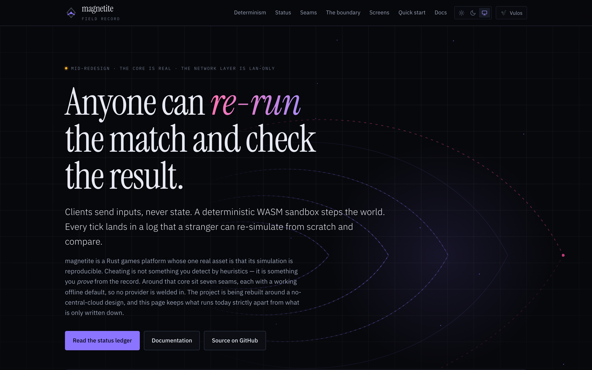
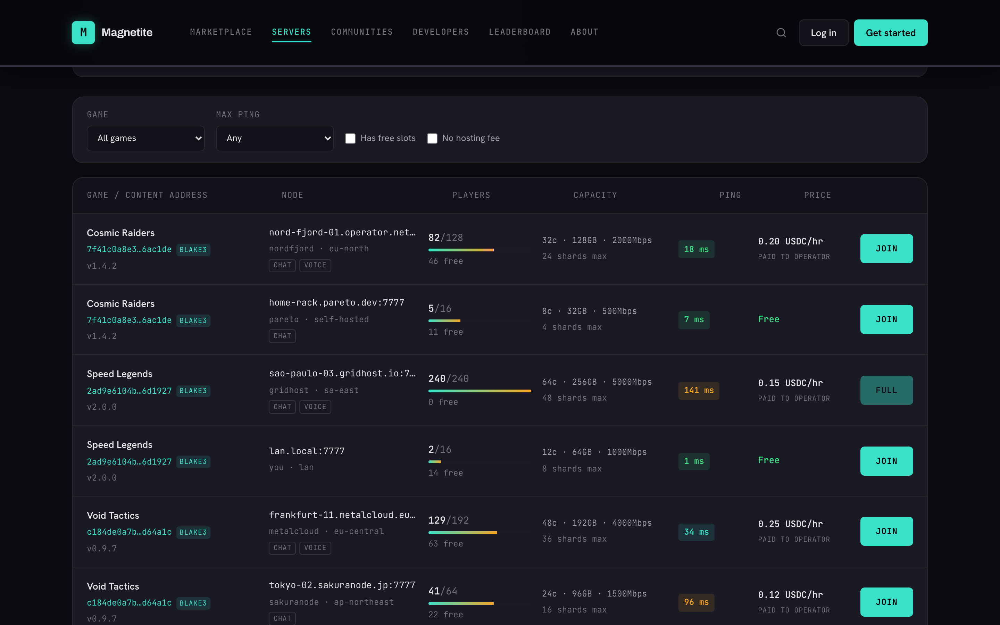
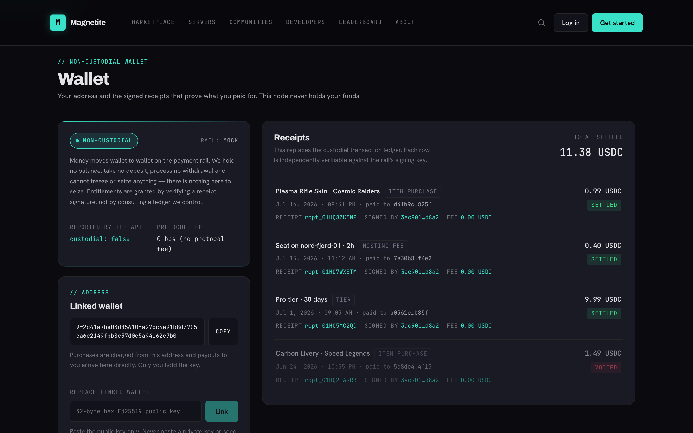
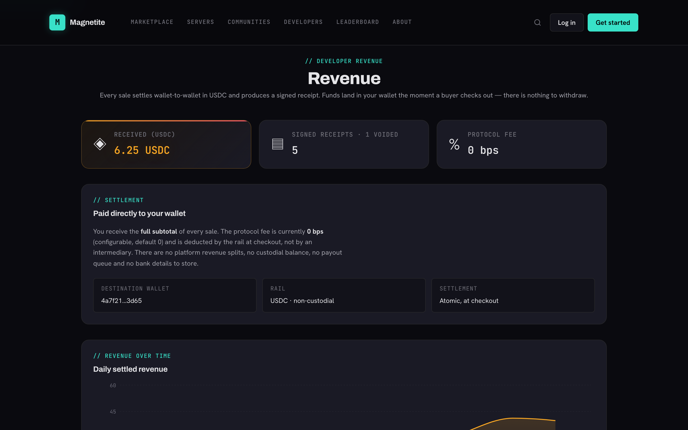
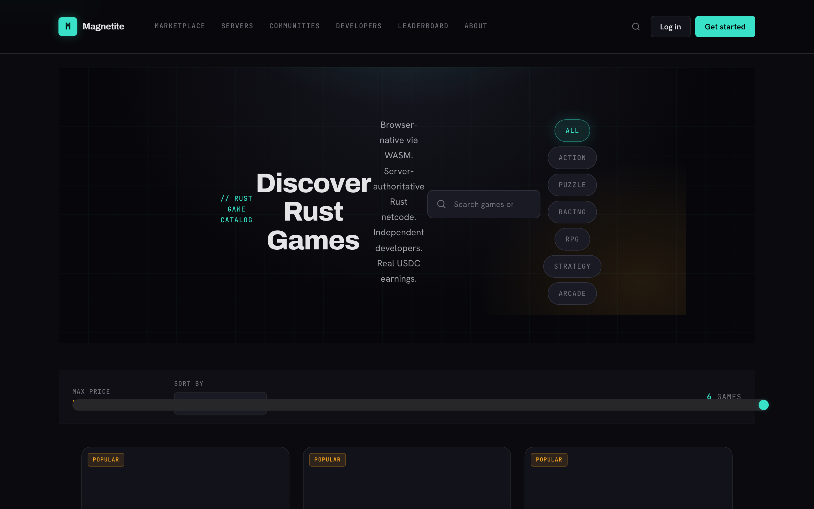
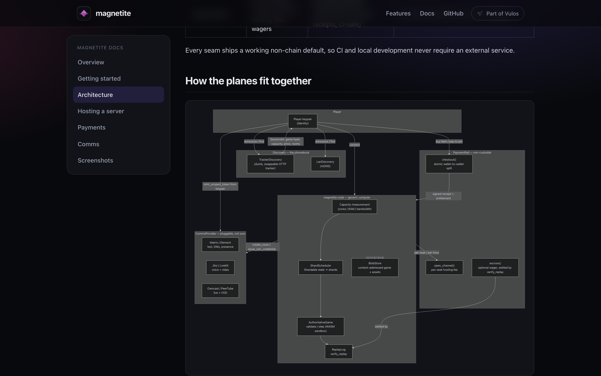
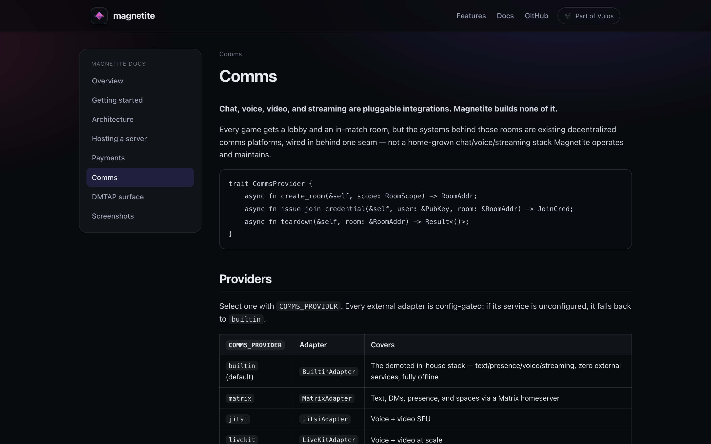
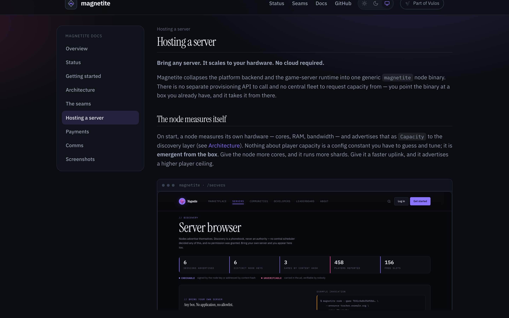
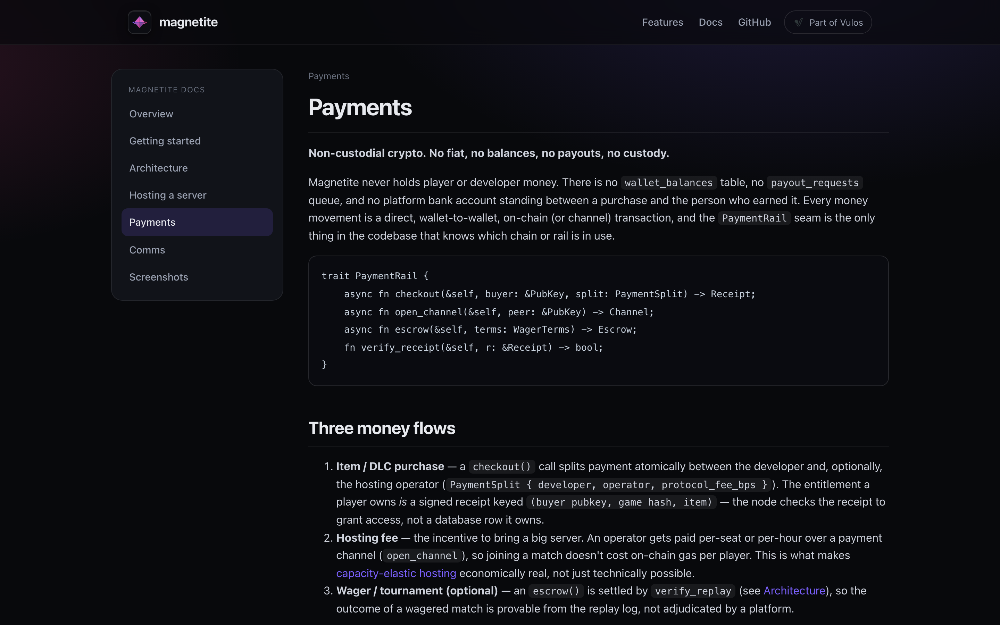

<div align="center">


# MAGNETITE

<sub>**Fe₃O₄ — magnetic, grounded**</sub>

***The decentralized, self-hostable Rust game platform.***<br>
**Bring any server. It scales to your hardware. No cloud required.**<br>
**Content-addressed games, deterministic WASM sandboxing, replay-verified anti-cheat, and non-custodial crypto payments.**

[](LICENSE)
[](https://www.rust-lang.org)
[](https://wasmtime.dev)
[](DECENTRALIZATION.md)
[](docs/hosting-a-server.md)

<sub> Part of <strong><a href="https://vulos.org">Vulos</a></strong> — the open, self-hostable web OS &amp; app suite. Runs perfectly standalone; no Vulos account required.</sub>

<br/>



</div>

---

## Overview

Magnetite is a decentralized, self-hostable Rust game platform: write a game
once against a deterministic authoritative-server SDK, and run it anywhere
from a laptop to a fleet you own — no central cloud, no fiat custody, and no
home-grown chat/voice/streaming stack standing between a player and the
person hosting them.

**A game is a content-addressed portable object. A node is generic compute
that fills its own hardware. The chain is the wallet. Discovery is a
phonebook, not an authority. Everything social — chat, voice, video,
streaming — is a pluggable integration, not something we build.**

Anyone runs the single `magnetite` node binary. Identity is a keypair.
Payments are non-custodial crypto. Comms are provided by existing
decentralized systems (Matrix/Element, Jitsi, LiveKit, Owncast/PeerTube)
through one adapter seam. The game runtime — authoritative simulation, WASM
sandbox, deterministic replay and anti-cheat — is the one thing Magnetite
owns outright, and it was decentralization-ready from day one. See
[`DECENTRALIZATION.md`](DECENTRALIZATION.md) for the full redesign spec.

[GitHub](https://github.com/vul-os/magnetite) · [Quick start](#quick-start) · [Docs](#documentation) · [Architecture](#architecture) · [License](#license)

---

## The moat — one Rust game, jam to AAA

> Nobody gives an open, Rust-native "same code, jam-to-AAA, authoritative +
> sandboxed + anti-cheat + one-command-deploy" primitive. That's what this is.

### Scale primitive — identical game code, topology auto-selected

Write your game once against `magnetite-sdk::authority::AuthoritativeGame`.
The platform runs it at any scale:

| Topology | Player count | How |
|----------|-------------|-----|
| `SingleRoom` | up to ~16 | 1 process, broadcast-all |
| `Dedicated` | up to ~256 | authoritative server, interest-filtered snapshots |
| `Sharded` | AAA / unbounded | spatial shards + cross-shard handoff |

`MatchConfig::auto(n)` escalates topology by player count. Your game code is
identical across all three.

Perf numbers (debug build, single-threaded in-proc, `magnetite-e2e` scale bench):

| Scenario | ticks/sec | μs/tick |
|----------|-----------|---------|
| SingleRoom (4 players) | 203,116 | 4.92 |
| SingleRoom (16 players) | 185,399 | 5.39 |
| Dedicated (32 players) | 151,388 | 6.61 |
| Dedicated (64 players) | 114,215 | 8.76 |
| Dedicated (128 players) | 78,950 | 12.67 |
| Dedicated (256 players) | 50,591 | 19.77 |

A release build is ~3–5× faster. The smoke-check assertion `ticks/sec ≥ 1,000`
is met with large margin.

### Wasmtime sandbox — untrusted game logic, deterministic by construction

Game logic compiles to `wasm32-wasip1` and runs inside a `WasmExecutor` with
hard guarantees:

- **Fuel budget** per tick (`fuel_per_step`) — runaway loops cannot stall the server.
- **Memory cap** (`max_memory_bytes`) — guest cannot exhaust host RAM.
- **Epoch interrupt** (`epoch_tick_ms × max_epochs_per_step`) — wall-clock timeout per step.
- **No OS randomness, no wall clock** — `random_get` and `clock_time_get` return `ENOSYS`. The only
  randomness source is `StepCtx.rng` (seeded `DeterministicRng`, xoshiro256**).

Result: same `(state, ordered commands, tick, seed)` always produces the same result, on any host.

### Anti-cheat by construction — server-authoritative + deterministic replay verification

1. Clients send *inputs*; the server runs `AuthoritativeGame::validate` to reject illegal actions, then
   `AuthoritativeGame::step` to advance state. Clients never send state.
2. The runtime records a `ReplayLog` (every tick's inputs + `state_hash`). `verify_replay` re-simulates
   from scratch; any divergence is tamper evidence or a determinism bug.
3. `magnetite-anticheat` adds composable `Validator`s (aimbot snap, position teleport, fire-rate flood)
   and a `TrustScoreMap` (Warn → Kick → Ban escalation with decay).

Proved end to end by `magnetite-e2e` (9 passing tests): `WasmExecutor` and
`NativeExecutor` produce identical `state_hash` on every tick, `verify_replay`
returns `Clean`, cheating inputs are rejected and escalate the trust score,
and a full-stack WebSocket test with 3 real clients confirms convergence.

---

## Decentralized by seam, not by rewrite

Everything provider-specific plugs in behind six traits (`magnetite-seams`).
The game runtime, scheduler, and payment path never name a provider type —
only the seam. Every seam ships a working, non-custodial, non-cloud default.

| Seam | Purpose | Default | Optional |
|------|---------|---------|----------|
| `Identity` / `AuthProvider` | keypair identity, sign-a-challenge login | `RawKeypairAuth` (Ed25519) | `DmtapAuth` (decentralized login) |
| `Naming` | human name ↔ raw key, display layer only | `HashNaming` | `DmtapNaming` (`name@domain` ladder) |
| `BlobStore` | content-addressed games and assets | `LocalBlobStore` + `HttpBlobStore` | `DmtapPubBlobStore` (MOTE); Iroh/BitTorrent |
| `Discovery` | the phonebook — never an authority | `TrackerDiscovery` + `LanDiscovery` (mDNS) | DHT adapter |
| `CommsProvider` | chat / voice / video / streaming | `BuiltinProvider` (fallback) | Matrix, Jitsi, LiveKit, Owncast/PeerTube |
| `PaymentRail` | non-custodial crypto checkout, hosting fees, wagers | `MockPaymentRail` (CI-safe) | on-chain rail (USDC on L2, or Solana) |

No fiat, no custody, no platform-held balances anywhere in the payment path —
see [docs/payments.md](docs/payments.md). No home-grown chat/voice/streaming
stack a game is forced to depend on — see [docs/comms.md](docs/comms.md). No
central server registry to poll for capacity — see
[docs/hosting-a-server.md](docs/hosting-a-server.md).

---

## Screenshots

The landing page and docs viewer share Magnetite's own dark, near-black
"lodestone" identity — a magnetic violet→magenta accent (`#7b61ff` →
`#ff4d9d`) evoking a magnetic field, over a graphite base darker than any
other Vulos product.

|  |  |
| :---: | :---: |
| **Server browser** — nodes self-advertise; discovery is a phonebook, never an authority | **Wallet** — non-custodial: an address you control plus signed receipts |
|  |  |
| **Developer revenue** — receipt-backed, paid straight to your wallet | **Game catalog** — content-addressed games |
|  |  |
| **Architecture** — node / discovery / payment / comms diagram | **Comms** — pluggable Matrix / Jitsi / LiveKit integrations |
|  |  |
| **Hosting a server** — capacity-elastic node model | **Payments** — non-custodial crypto |
|  |  |

> Regenerate anytime with `npm run screenshotter` (alias: `npm run
> screenshots`) — it serves the static site with a tiny built-in Node server,
> boots the app on a throwaway `vite` dev server with `VITE_USE_MOCKS=true`,
> and captures every surface in light **and** dark at retina. No backend,
> database or wasm build required. See
> [docs/screenshots.md](docs/screenshots.md) for the full gallery.

---

## Quick start

```bash
# install once
cargo install magnetite-cli

# scaffold a crate implementing AuthoritativeGame
magnetite new my-game
cd my-game

# cargo build --release --target wasm32-wasip1 → game.wasm
magnetite build

# build → WasmExecutor → SingleRoom server, ZERO backend
magnetite dev
# ws://127.0.0.1:<port> — play it right now

# bring your own box: measures its hardware, advertises
# capacity, joins the discovery mesh
magnetite serve --wasm path/to/game.wasm --advertise tracker.example.org
```

`magnetite dev` already runs a game with zero backend, and `magnetite serve`
already takes an arbitrary box you own — there is no cloud account to create
and no capacity to request. See [Getting started](docs/getting-started.md)
for the full walkthrough.

### Repo development (this checkout)

The Rust workspace and the legacy React marketplace frontend still build the
same way as before:

```bash
# Frontend (pre-decentralization marketplace UI, being rebuilt against the seams)
npm install
npm run dev          # http://localhost:5173

# Rust workspace
cargo build --workspace
cargo test --workspace

# Authoritative runtime standalone (smoke-test mode, no wasm required)
cargo run --package magnetite-runtime --bin serve
```

---

## Architecture

```
Player keypair (Identity)
        │
        ▼
Discovery (TrackerDiscovery + LanDiscovery) ──announce/find──► magnetite node
        │                                        │  ├─ Capacity measurement
        │                                        │  ├─ ShardScheduler
        ▼                                        │  ├─ AuthoritativeGame (WASM sandbox)
   SessionAd (game hash, capacity, price, rooms)  │  ├─ ReplayLog / verify_replay
                                                  │  └─ BlobStore (content-addressed)
                                                  │
                          ┌───────────────────────┼───────────────────────┐
                          ▼                                               ▼
              PaymentRail (non-custodial)                   CommsProvider (pluggable)
              checkout · open_channel · escrow               Matrix · Jitsi/LiveKit · Owncast
```

Full diagram (mermaid) + the seam trait signatures: [docs/architecture.md](docs/architecture.md).
Full redesign spec + program backlog: [`DECENTRALIZATION.md`](DECENTRALIZATION.md).

### Crate map

| Crate | Role |
|-------|------|
| `magnetite-seams` | The six seam traits + non-custodial, non-cloud default implementations |
| `backend/magnetite-sdk` (`::authority`) | Frozen traits: `AuthoritativeGame`, `GameExecutor`, `NativeExecutor`, `Validator`, `ReplayLog`, `verify_replay`, `Topology`, `MatchConfig`, `DeterministicRng` |
| `magnetite-runtime` | Authoritative game-server host: tick loop, WebSocket connection mgmt, interest-filtered delta/snapshot fan-out, `ShardManager` seam; `magnetite-serve` binary |
| `magnetite-sandbox` | `WasmExecutor` — Wasmtime host implementing `GameExecutor`; fuel/memory/epoch limits; WASI stubs (no clock, no rng) |
| `magnetite-anticheat` | Composable validators, `TrustScoreMap`, `ReplayVerifier` |
| `magnetite-cli` | `magnetite new\|build\|dev\|deploy\|serve` binary |
| `magnetite-web-client` | JS web client speaking `ClientNet`/`ServerNet`; prediction buffer; canvas renderer; in-browser replay playback |
| `game-template-authoritative` | Reference game (top-down arena shooter) implementing `AuthoritativeGame`; canonical wasm ABI exports behind `--features wasm` |
| `game-client-bevy` | Bevy client with prediction/reconciliation (`PredictionBuffer` + `ClientPredictor`) wired to `ServerNet` |
| `magnetite-e2e` | Integration tests: convergence + `verify_replay` clean + anti-cheat WS rejection + wasm parity vs native + full-stack WS + scale bench |

---

## SDK quick-start

```rust
use magnetite_sdk::{
    export_game,
    game::{GameLogic, GameMetadata},
    input::{Action, Input},
    state::{GameState, PlayerId, Snapshot},
};

struct MyGame { state: GameState }

impl GameLogic for MyGame {
    fn new() -> Self { MyGame { state: GameState::default() } }
    fn handle_input(&mut self, _pid: PlayerId, _input: Input) -> Action { Action::None }
    fn tick(&mut self) { self.state.tick += 1; }
    fn state(&self) -> &GameState { &self.state }
    fn players(&self) -> Vec<PlayerId> { vec![] }
    fn metadata(&self) -> GameMetadata { GameMetadata::default() }
    fn snapshot(&self) -> Snapshot { Snapshot::new(self.state.tick, self.state.clone()) }
    fn restore(&mut self, snap: Snapshot) { self.state = snap.state; }
}

export_game!(MyGame);
```

For the server-authoritative path:

```rust
use magnetite_sdk::authority::{AuthoritativeGame, Topology, MatchConfig};

// Implement AuthoritativeGame, then:
let cfg = MatchConfig::auto(player_count);  // SingleRoom / Dedicated / Sharded
```

See [`backend/magnetite-sdk/`](backend/magnetite-sdk/) and
[`game-template/`](game-template/) for the full starter, and
[`game-template-authoritative/`](game-template-authoritative/) for the
canonical `AuthoritativeGame` reference implementation.

---

## Documentation

| Guide | File |
|-------|------|
| Overview | [docs/overview.md](docs/overview.md) |
| Getting started | [docs/getting-started.md](docs/getting-started.md) |
| Architecture (seams + planes, mermaid diagram) | [docs/architecture.md](docs/architecture.md) |
| Hosting a server (capacity-elastic nodes) | [docs/hosting-a-server.md](docs/hosting-a-server.md) |
| Payments (non-custodial crypto) | [docs/payments.md](docs/payments.md) |
| Comms (Matrix / Jitsi / LiveKit / Owncast) | [docs/comms.md](docs/comms.md) |
| Screenshots | [docs/screenshots.md](docs/screenshots.md) |
| Decentralization spec + backlog | [DECENTRALIZATION.md](DECENTRALIZATION.md) |
| MOAT Architecture | [docs/MOAT-ARCHITECTURE.md](docs/MOAT-ARCHITECTURE.md) |
| MOAT Scaling (topology + bench) | [docs/moat/scaling.md](docs/moat/scaling.md) |
| Replay & Spectator | [docs/moat/replay-spectator.md](docs/moat/replay-spectator.md) |
| Developer Quickstart (SDK) | [docs/for-developers/quickstart.md](docs/for-developers/quickstart.md) |
| Self-Hosting Guide | [docs/self-hosting/index.md](docs/self-hosting/index.md) |
| Security & Sandboxing | [docs/security/index.md](docs/security/index.md) |

Interactive docs site (static, no build step): open
[`site/docs.html`](site/docs.html), or the [landing page](site/index.html).

---

## Development

**Prerequisites:** Rust 1.82+ (with `wasm32-wasip1` target), Node.js 18+.

```bash
rustup target add wasm32-wasip1

cargo build --workspace
cargo test --workspace
cargo clippy --workspace

npm install
npm run dev              # legacy marketplace frontend (Vite, :5173)
npm run lint
npm run test:run         # Vitest
npm run screenshotter     # regenerate docs/screenshots/ (alias: npm run screenshots)
```

> **Frozen invariant:** the game runtime, scheduler, and payment path never
> name a provider-specific type — every provider integration goes through
> `magnetite-seams`. See [DECENTRALIZATION.md § 6](DECENTRALIZATION.md#6-guardrails-for-all-agents).

---

## License

MIT — see [LICENSE](LICENSE). Platform, SDK, and game templates are all MIT.

## Contributing

See [CONTRIBUTING.md](CONTRIBUTING.md).

---

<div align="center">

<a href="https://github.com/vul-os/magnetite">GitHub</a> · <a href="https://github.com/vul-os/magnetite/issues">Issues</a> · <a href="DECENTRALIZATION.md">Decentralization spec</a>

<br>

<sub><strong>Magnetite</strong> is a free, open-source, self-hostable, decentralized Rust game platform.<br>
Built as an alternative to Nakama, PlayFab, and Roblox — without the custody, without the cloud lock-in.</sub>

</div>

---

<sub> · <strong>Built with purpose. Open by design.</strong></sub>
