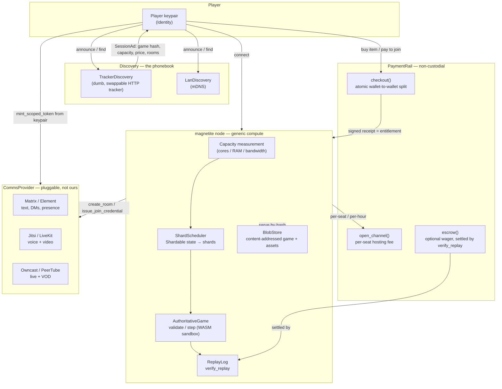

# Architecture

> **This page describes the decentralization architecture** — the seams and
> planes defined in [`DECENTRALIZATION.md`](../DECENTRALIZATION.md), the
> single source of truth for the redesign. Magnetite splits cleanly into two
> halves: **the moat** (the game core, which Magnetite owns and operates
> directly) and **the seams** (everything provider-specific, which plugs in
> behind a small set of traits). The game runtime, scheduler, and payment path
> never name a provider-specific type — they see only the trait.

## The moat

- `magnetite-sdk::authority::AuthoritativeGame` — deterministic
  `validate`/`step`. Clients send inputs, never state.
- The WASM sandbox (`magnetite-sandbox`) — same `(state, ordered commands,
  tick, seed)` → same result, on any host.
- `ReplayLog` + `verify_replay` (`magnetite-anticheat`) — anyone can
  re-simulate from scratch and prove tampering.
- The topology ladder `SingleRoom → Dedicated → Sharded` — identical game code
  runs at any scale; the scheduler picks the topology.

## The seams

All seam traits live in `magnetite-seams` — traits plus default,
non-custodial, non-cloud implementations. Nothing in the game runtime,
scheduler, or payment path may name a provider-specific type.

| Seam | Purpose | Default | Optional |
|------|---------|---------|----------|
| `Identity` / `AuthProvider` | keypair identity, sign-a-challenge login, scoped token minting for comms | `RawKeypairAuth` (Ed25519) | `DmtapAuth` (decentralized login, key transparency) |
| `Naming` | human name ↔ raw key, display layer only | `HashNaming` (raw pubkey / short hash) | `DmtapNaming` (`name@domain` ladder, 8-word zero-authority floor) |
| `BlobStore` | content-addressed games and assets | `LocalBlobStore` + `HttpBlobStore` | `DmtapPubBlobStore` (MOTE over DMTAP-PUB); Iroh/BitTorrent later |
| `Discovery` | the phonebook — never an authority | `TrackerDiscovery` (dumb, swappable HTTP tracker) + `LanDiscovery` (mDNS) | DHT adapter |
| `CommsProvider` | chat / voice / video / streaming | `BuiltinProvider` (fallback shim) | `MatrixProvider`, `JitsiProvider`, `LiveKitProvider`, `OwncastProvider`/`PeerTubeProvider`, `DmtapCommsProvider` |
| `PaymentRail` | non-custodial crypto checkout, hosting fees, wagers | `MockPaymentRail` (deterministic signed receipts, CI-safe) | on-chain rail (USDC on an L2, or Solana) |

Every seam ships a working non-DMTAP, non-chain default, so CI and local
development never require an external service.

## How the planes fit together

## Money flows (non-custodial only)

There are no balances, no payouts, and no custody anywhere in the payment
path. See [Payments](payments.md) for the full model:

1. **Item / DLC purchase** — atomic wallet-to-wallet split to the developer
   (and optional operator); the entitlement *is* a signed receipt keyed
   `(buyer pubkey, game hash, item)`. The node reads the receipt to grant
   access.
2. **Hosting fee** — the incentive to bring a big server: an operator is paid
   per-seat or per-hour over a payment channel, so joining a match doesn't
   cost on-chain gas per player.
3. **Wager / tournament (optional)** — an escrow settled by `verify_replay`,
   so the outcome is provable, not trusted.

## Capacity-elastic scaling

See [Hosting a server](hosting-a-server.md) for the full "bring any server, it
scales to your hardware" model: a node measures its own capacity, a world is a
set of shards, and a cluster of boxes — even boxes owned by different
operators — becomes a federated mesh with cross-node handoff, paid through the
`PaymentRail`.

## Comms bridge

The identity seam is what makes single-sign-on into pluggable comms possible:
the node mints scoped, short-lived credentials (`AuthProvider::mint_scoped_token`)
from the player's own keypair — a Matrix OpenID token, a Jitsi JWT, a LiveKit
token — so one login gets you into every room. See [Comms](comms.md).

## Crate map

| Crate | Role |
|-------|------|
| `magnetite-seams` | The six seam traits (§ above) + non-custodial, non-cloud default implementations |
| `backend/magnetite-sdk` (`::authority`) | Frozen traits: `AuthoritativeGame`, `GameExecutor`, `Validator`, `ReplayLog`, `verify_replay`, `Topology`, `MatchConfig`, `DeterministicRng` |
| `magnetite-runtime` | Authoritative game-server host: tick loop, WebSocket connection mgmt, interest-filtered snapshot fan-out, `ShardManager` seam |
| `magnetite-sandbox` | `WasmExecutor` — Wasmtime host implementing `GameExecutor`; fuel/memory/epoch limits; no clock, no OS rng |
| `magnetite-anticheat` | Composable validators, `TrustScoreMap`, `ReplayVerifier` |
| `magnetite-cli` | `magnetite new\|build\|dev\|deploy\|serve` binary |
| `magnetite-web-client` | JS web client speaking `ClientNet`/`ServerNet`; prediction buffer; in-browser replay playback |
| `game-template-authoritative` | Reference game (top-down arena shooter) implementing `AuthoritativeGame`; canonical wasm ABI exports |
| `game-client-bevy` | Bevy client with prediction/reconciliation wired to `ServerNet` |
| `magnetite-e2e` | Integration tests: convergence + `verify_replay` clean + anti-cheat rejection + wasm/native parity + full-stack WS + scale bench |

For the full backlog and seam trait signatures, see
[`DECENTRALIZATION.md`](../DECENTRALIZATION.md) at the repo root.
