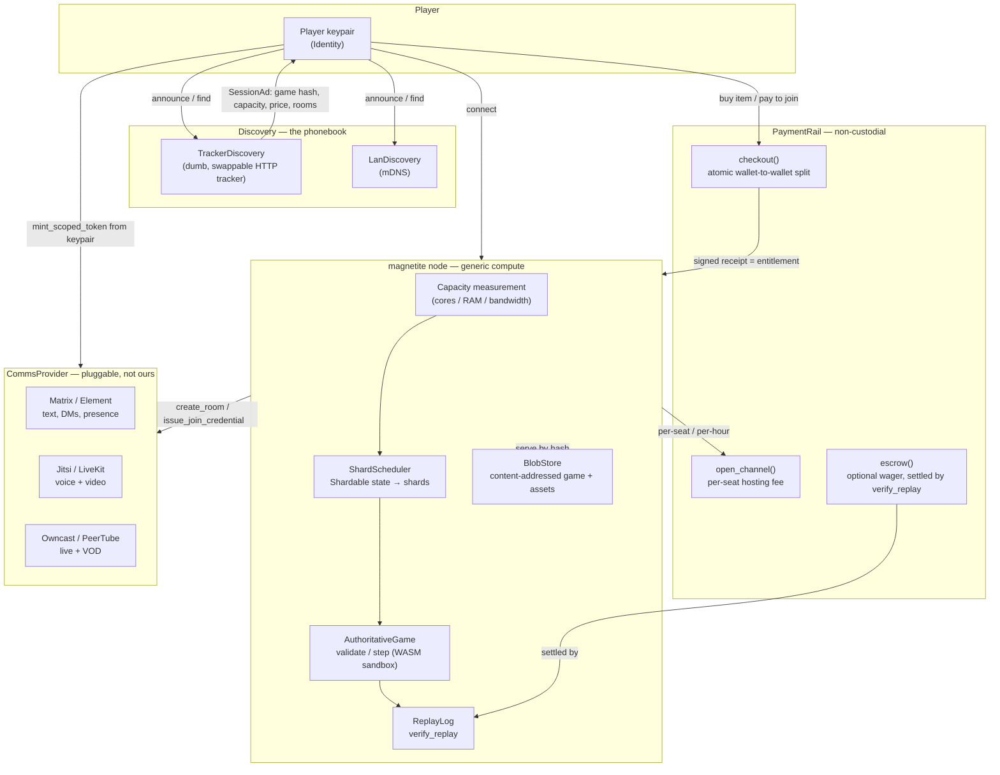

# Architecture

> **This page describes the decentralization architecture** — the seams and
> planes defined in [`DECENTRALIZATION.md`](https://github.com/vul-os/magnetite/blob/main/DECENTRALIZATION.md), the
> single source of truth for the redesign. Magnetite splits cleanly into two
> halves: **the moat** (the game core, which Magnetite owns and operates
> directly) and **the seams** (everything provider-specific, which plugs in
> behind a small set of traits). The game runtime, scheduler, and payment path
> never name a provider-specific type — they see only the trait.

## The moat

- `magnetite-sdk::authority::AuthoritativeGame` — deterministic
  `validate`/`step`. Clients send inputs, never state.
- The WASM sandbox (`magnetite-sandbox`) — same `(state, ordered commands,
  tick, seed)` → same result, on any host.
- `ReplayLog` + `verify_replay` (`magnetite-anticheat`) — anyone can
  re-simulate from scratch and prove tampering.
- The topology ladder `SingleRoom → Dedicated → Sharded` — identical game code
  runs at any scale; the scheduler picks the topology.

<svg viewBox="0 0 900 260" role="img" aria-label="The authority loop: clients send only inputs to an authoritative host, which validates them and steps a WASM sandbox with a fuel budget and no clock or OS randomness; every tick appends its inputs and state hash to a replay log that any third party can re-simulate.">
<g font-family="var(--doc-mono)" font-size="11">
<text x="30" y="26" fill="var(--accent)" font-size="10" letter-spacing="1.6">THE AUTHORITY LOOP</text>
<rect x="30" y="52" width="118" height="40" rx="7" fill="none" stroke="var(--dv-border-2)"/>
<text x="89" y="77" fill="var(--dv-ink-2)" text-anchor="middle">client A</text>
<rect x="30" y="104" width="118" height="40" rx="7" fill="none" stroke="var(--dv-border-2)"/>
<text x="89" y="129" fill="var(--dv-ink-2)" text-anchor="middle">client B</text>
<text x="89" y="170" fill="var(--dv-ink-faint)" font-size="10" text-anchor="middle">inputs only —</text>
<text x="89" y="185" fill="var(--dv-ink-faint)" font-size="10" text-anchor="middle">never state</text>
<rect x="238" y="52" width="150" height="92" rx="8" fill="none" stroke="var(--accent)" stroke-width="1.6"/>
<text x="313" y="80" fill="var(--dv-ink)" text-anchor="middle" font-size="12">host</text>
<text x="313" y="102" fill="var(--dv-ink-3)" text-anchor="middle" font-size="10">validate()</text>
<text x="313" y="120" fill="var(--dv-ink-3)" text-anchor="middle" font-size="10">step()</text>
<rect x="238" y="176" width="150" height="52" rx="8" fill="none" stroke="var(--dv-border-2)"/>
<text x="313" y="198" fill="var(--dv-ink-2)" text-anchor="middle" font-size="10.5">WASM sandbox</text>
<text x="313" y="215" fill="var(--dv-ink-faint)" text-anchor="middle" font-size="9.5">fuel · no clock · no rng</text>
<rect x="478" y="52" width="140" height="92" rx="8" fill="none" stroke="var(--dv-border-2)"/>
<text x="548" y="78" fill="var(--dv-ink-2)" text-anchor="middle" font-size="11">ReplayLog</text>
<text x="548" y="100" fill="var(--dv-ink-faint)" text-anchor="middle" font-size="9.5">ordered inputs</text>
<text x="548" y="116" fill="var(--dv-ink-faint)" text-anchor="middle" font-size="9.5">+ state hash</text>
<text x="548" y="132" fill="var(--dv-ink-faint)" text-anchor="middle" font-size="9.5">+ seed</text>
<rect x="708" y="52" width="162" height="92" rx="8" fill="none" stroke="var(--accent)" stroke-dasharray="4 4"/>
<text x="789" y="78" fill="var(--accent)" text-anchor="middle" font-size="11">anyone</text>
<text x="789" y="100" fill="var(--dv-ink-3)" text-anchor="middle" font-size="9.5">re-simulates from</text>
<text x="789" y="116" fill="var(--dv-ink-3)" text-anchor="middle" font-size="9.5">scratch, compares</text>
<text x="789" y="132" fill="var(--dv-ink-3)" text-anchor="middle" font-size="9.5">hash by hash</text>
<text x="789" y="170" fill="var(--dv-ink-faint)" font-size="10" text-anchor="middle">no privileged access</text>
<text x="789" y="185" fill="var(--dv-ink-faint)" font-size="10" text-anchor="middle">required</text>
</g>
<g stroke="var(--dv-border-2)" stroke-width="1.5" fill="none" marker-end="url(#aar)">
<path d="M152 72 H232"/><path d="M152 124 H232"/>
<path d="M313 148 V172"/><path d="M392 98 H472"/><path d="M622 98 H702"/>
</g>
<path d="M238 200 H190 V96 H232" stroke="var(--dv-border-2)" stroke-width="1.5" fill="none" marker-end="url(#aar)"/>
<defs><marker id="aar" viewBox="0 0 10 10" refX="8" refY="5" markerWidth="5" markerHeight="5" orient="auto"><path d="M0 0 L10 5 L0 10 z" fill="var(--dv-border-2)"/></marker></defs>
</svg>

<b>Figure 1 — inputs in, a checkable record out</b>The sandbox's <em>absences</em> are what make this work: with no wall clock and no OS randomness reachable from the guest, the same ordered commands from the same seed reproduce the same state anywhere. That is the only reason a log can be checked at all.

Re-simulation is a comparison, not a judgement. The verifier replays the log and
compares state hashes tick by tick; a divergence is located at a specific tick
rather than inferred from a player's behaviour:

<svg viewBox="0 0 900 200" role="img" aria-label="Re-simulation comparison: the host run and an independent re-run produce identical state hashes for ticks 1041 to 1043, then diverge at tick 1044, where verification halts and reports the divergence.">
<g font-family="var(--doc-mono)" font-size="10.5">
<text x="30" y="24" fill="var(--dv-ink-faint)" font-size="9.5" letter-spacing="1.4">TICK</text>
<text x="110" y="24" fill="var(--dv-ink-faint)" font-size="9.5" letter-spacing="1.4">HOST — AUTHORITATIVE RUN</text>
<text x="480" y="24" fill="var(--dv-ink-faint)" font-size="9.5" letter-spacing="1.4">ANYONE — INDEPENDENT RE-RUN</text>
<line x1="30" y1="34" x2="870" y2="34" stroke="var(--dv-border)"/>
<text x="30" y="58" fill="var(--dv-ink-faint)">1041</text>
<text x="110" y="58" fill="var(--dv-ink-3)">state 7f41c0a8e3…938ab1</text>
<text x="480" y="58" fill="var(--dv-ink-3)">state 7f41c0a8e3…938ab1</text>
<text x="820" y="58" fill="var(--mg-live)" font-size="13">=</text>
<text x="30" y="84" fill="var(--dv-ink-faint)">1042</text>
<text x="110" y="84" fill="var(--dv-ink-3)">state 2ad9e6104b…fb03c8</text>
<text x="480" y="84" fill="var(--dv-ink-3)">state 2ad9e6104b…fb03c8</text>
<text x="820" y="84" fill="var(--mg-live)" font-size="13">=</text>
<text x="30" y="110" fill="var(--dv-ink-faint)">1043</text>
<text x="110" y="110" fill="var(--dv-ink-3)">state c184de0a7b…3c5e29</text>
<text x="480" y="110" fill="var(--dv-ink-3)">state c184de0a7b…3c5e29</text>
<text x="820" y="110" fill="var(--mg-live)" font-size="13">=</text>
<rect x="24" y="120" width="852" height="30" rx="4" fill="var(--mg-bnd)" opacity=".09"/>
<text x="30" y="140" fill="var(--mg-bnd)" font-weight="600">1044</text>
<text x="110" y="140" fill="var(--mg-bnd)" font-weight="600">state 9f2c41a7be…d85610</text>
<text x="480" y="140" fill="var(--mg-bnd)" font-weight="600">state 5c8de4f13a…0b7e2c</text>
<text x="820" y="140" fill="var(--mg-bnd)" font-size="13" font-weight="600">≠</text>
<text x="30" y="176" fill="var(--dv-ink-faint)">1045</text>
<text x="110" y="176" fill="var(--dv-ink-faint)">—</text>
<text x="480" y="176" fill="var(--dv-ink-faint)">halted: divergence at tick 1044</text>
</g>
</svg>

<b>Figure 2 — what <code>verify_replay</code> returns</b>Tampering is <em>located</em>, not scored. Note the colour: magenta marks the one place this guarantee stops — see the input seam, where sensor-derived events cannot be re-derived from a log at all.

## The seams

All seam traits live in `magnetite-seams` — traits plus default,
non-custodial, non-cloud implementations. Nothing in the game runtime,
scheduler, or payment path may name a provider-specific type.

| Seam | Purpose | Default | Optional |
|------|---------|---------|----------|
| `Identity` / `AuthProvider` | keypair identity, sign-a-challenge login, scoped token minting for comms | `RawKeypairAuth` (Ed25519) | any external IdP (e.g. an OIDC bridge) — none ships today |
| `Naming` | human name ↔ raw key, display layer only | `HashNaming` (raw pubkey / short hash) | `KeyNameNaming` (word-based key-names, `--features keyname`) |
| `BlobStore` | content-addressed games and assets | `LocalBlobStore` + `HttpBlobStore` | Iroh/BitTorrent adapter later |
| `Discovery` | the phonebook — never an authority | `TrackerDiscovery` (dumb, swappable HTTP tracker) + `LanDiscovery` (mDNS) | DHT adapter |
| `CommsProvider` | chat / voice / video / streaming | `BuiltinProvider` (fallback shim) | `MatrixProvider`, `JitsiProvider`, `LiveKitProvider`, `OwncastProvider`/`PeerTubeProvider` |
| `PaymentRail` | non-custodial crypto checkout, hosting fees, wagers | `MockPaymentRail` (deterministic signed receipts, CI-safe) | on-chain rail (USDC on an L2, or Solana) |

Every seam ships a working non-chain default, so CI and local
development never require an external service.

## How the planes fit together

## Money flows (non-custodial only)

There are no balances, no payouts, and no custody anywhere in the payment
path. See [Payments](./docs.html#payments) for the full model:

1. **Item / DLC purchase** — atomic wallet-to-wallet split to the developer
   (and optional operator); the entitlement *is* a signed receipt keyed
   `(buyer pubkey, game hash, item)`. The node reads the receipt to grant
   access.
2. **Hosting fee** — the incentive to bring a big server: an operator is paid
   per-seat or per-hour over a payment channel, so joining a match doesn't
   cost on-chain gas per player.
3. **Wager / tournament (optional)** — an escrow settled by `verify_replay`,
   so the outcome is provable, not trusted.

## Capacity-elastic scaling

See [Hosting a server](./docs.html#hosting-a-server) for the full "bring any server, it
scales to your hardware" model: a node measures its own capacity, a world is a
set of shards, and a cluster of boxes — even boxes owned by different
operators — becomes a federated mesh with cross-node handoff, paid through the
`PaymentRail`.

## Comms bridge

The identity seam is what makes single-sign-on into pluggable comms possible:
the node mints scoped, short-lived credentials (`AuthProvider::mint_scoped_token`)
from the player's own keypair — a Matrix OpenID token, a Jitsi JWT, a LiveKit
token — so one login gets you into every room. See [Comms](./docs.html#comms).

## Crate map

| Crate | Role |
|-------|------|
| `magnetite-seams` | The six seam traits (§ above) + non-custodial, non-cloud default implementations |
| `backend/magnetite-sdk` (`::authority`) | Frozen traits: `AuthoritativeGame`, `GameExecutor`, `Validator`, `ReplayLog`, `verify_replay`, `Topology`, `MatchConfig`, `DeterministicRng` |
| `magnetite-runtime` | Authoritative game-server host: tick loop, WebSocket connection mgmt, interest-filtered snapshot fan-out, `ShardManager` seam |
| `magnetite-sandbox` | `WasmExecutor` — Wasmtime host implementing `GameExecutor`; fuel/memory/epoch limits; no clock, no OS rng |
| `magnetite-anticheat` | Composable validators, `TrustScoreMap`, `ReplayVerifier` |
| `magnetite-cli` | `magnetite new\|build\|dev\|deploy\|serve` binary |
| `magnetite-web-client` | JS web client speaking `ClientNet`/`ServerNet`; prediction buffer; in-browser replay playback |
| `game-template-authoritative` | Reference game (top-down arena shooter) implementing `AuthoritativeGame`; canonical wasm ABI exports |
| `game-client-bevy` | Bevy client with prediction/reconciliation wired to `ServerNet` |
| `magnetite-e2e` | Integration tests: convergence + `verify_replay` clean + anti-cheat rejection + wasm/native parity + full-stack WS + scale bench |

For the full backlog and seam trait signatures, see
[`DECENTRALIZATION.md`](https://github.com/vul-os/magnetite/blob/main/DECENTRALIZATION.md) at the repo root.
