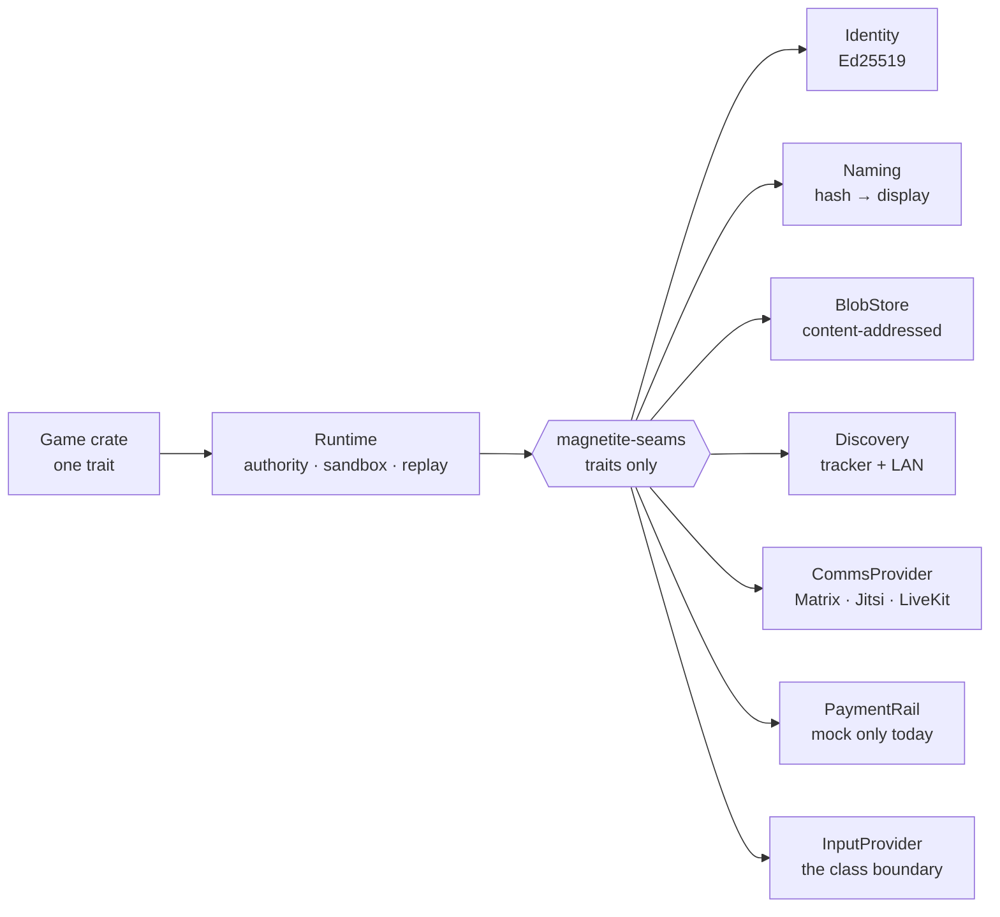

# Overview

**A game is a content-addressed portable object. A node is generic compute that
fills its own hardware. Discovery is a phonebook, not an authority. Everything
social — chat, voice, video, streaming — is a pluggable integration, not
something we build.**

Magnetite is a decentralized, self-hostable Rust game platform. There is no
central cloud: anyone runs the single `magnetite` node binary. Identity is a
keypair. Payments are non-custodial. Comms are provided by existing
decentralized systems (Matrix/Element, Jitsi, LiveKit, Owncast/PeerTube)
through one adapter seam. The game runtime — authoritative simulation, WASM
sandbox, deterministic replay and anti-cheat — is the one thing Magnetite owns
outright, and it is the part that was decentralization-ready from day one.

<svg viewBox="0 0 900 250" role="img" aria-label="Three-part diagram: a game is a hash-identified portable object; a node is generic compute that measures and fills its own hardware; discovery is a phonebook of signed self-advertisements, not an authority.">
<g font-family="var(--doc-mono)" font-size="11">
<!-- 1. portable object -->
<text x="40" y="34" fill="var(--accent)" font-size="10" letter-spacing="1.6">01 — PORTABLE OBJECT</text>
<rect x="40" y="52" width="200" height="86" rx="8" fill="none" stroke="var(--dv-border-2)"/>
<text x="60" y="80" fill="var(--dv-ink-2)">game.wasm + manifest</text>
<line x1="60" y1="94" x2="220" y2="94" stroke="var(--dv-border)"/>
<text x="60" y="114" fill="var(--accent)" font-size="10">blake3 7f41c0a8…938ab1</text>
<text x="60" y="130" fill="var(--dv-ink-faint)" font-size="10">the hash IS the id</text>
<text x="40" y="168" fill="var(--dv-ink-3)" font-size="10.5">No registry row is</text>
<text x="40" y="184" fill="var(--dv-ink-3)" font-size="10.5">needed to identify it.</text>
<!-- 2. generic node -->
<text x="350" y="34" fill="var(--accent)" font-size="10" letter-spacing="1.6">02 — GENERIC NODE</text>
<rect x="350" y="52" width="200" height="86" rx="8" fill="none" stroke="var(--dv-border-2)"/>
<text x="370" y="78" fill="var(--dv-ink-2)">measures its own box</text>
<line x1="370" y1="90" x2="530" y2="90" stroke="var(--dv-border)"/>
<text x="370" y="108" fill="var(--dv-ink-3)" font-size="10">32 cores · 128 GB</text>
<g>
<rect x="370" y="118" width="26" height="12" rx="2" fill="var(--accent)" opacity=".8"/>
<rect x="400" y="118" width="26" height="12" rx="2" fill="var(--accent)" opacity=".6"/>
<rect x="430" y="118" width="26" height="12" rx="2" fill="var(--accent)" opacity=".4"/>
<rect x="460" y="118" width="26" height="12" rx="2" fill="var(--dv-border-2)"/>
</g>
<text x="350" y="168" fill="var(--dv-ink-3)" font-size="10.5">Player cap is emergent</text>
<text x="350" y="184" fill="var(--dv-ink-3)" font-size="10.5">from hardware, never</text>
<text x="350" y="200" fill="var(--dv-ink-3)" font-size="10.5">a config constant.</text>
<!-- 3. phonebook -->
<text x="660" y="34" fill="var(--accent)" font-size="10" letter-spacing="1.6">03 — PHONEBOOK</text>
<rect x="660" y="52" width="200" height="86" rx="8" fill="none" stroke="var(--dv-border-2)"/>
<text x="680" y="78" fill="var(--dv-ink-2)">signed SessionAd</text>
<line x1="680" y1="90" x2="840" y2="90" stroke="var(--dv-border)"/>
<text x="680" y="108" fill="var(--dv-ink-3)" font-size="10">node · capacity · price</text>
<text x="680" y="126" fill="var(--dv-ink-faint)" font-size="10">leased · TTL-capped</text>
<text x="660" y="168" fill="var(--dv-ink-3)" font-size="10.5">A tracker can refuse a</text>
<text x="660" y="184" fill="var(--dv-ink-3)" font-size="10.5">forgery, but gains no say</text>
<text x="660" y="200" fill="var(--dv-ink-3)" font-size="10.5">over who may host what.</text>
</g>
<g stroke="var(--dv-border-2)" stroke-width="1.4" fill="none">
<path d="M256 95 H334" marker-end="url(#mgar)"/>
<path d="M566 95 H644" marker-end="url(#mgar)"/>
</g>
<defs><marker id="mgar" viewBox="0 0 10 10" refX="8" refY="5" markerWidth="5" markerHeight="5" orient="auto"><path d="M0 0 L10 5 L0 10 z" fill="var(--dv-border-2)"/></marker></defs>
</svg>

<b>Figure 1 — the thesis in three parts</b>Nothing in this chain requires a central authority to exist. A game is named by its content, a node is named by its key, and the phonebook only relays what nodes said about themselves.

> [!IMPORTANT]
> Magnetite is **mid-redesign**. The deterministic game core is real and
> tested; the multi-node network layer is proven **on a LAN only**, and the only
> payment rail that ships is a deterministic offline mock.
> [Status](./docs.html#status) is the audited, component-by-component
> account — read it before planning anything.

## The moat: one Rust game, one trait

Write your game once against `magnetite-sdk::authority::AuthoritativeGame`.
The platform escalates topology rather than making you rewrite game code:

| Topology | Player count | How | State |
|----------|-------------|-----|-------|
| `SingleRoom` | up to ~16 | one process, broadcast-all | Working |
| `Dedicated` | up to ~256 | authoritative server, interest-filtered snapshots | Working |
| `Sharded` (one operator) | multi-shard | spatial shards + cross-node handoff | Working, **LAN only** |
| `Sharded` (federated) | unbounded | other operators' nodes join the mesh | **Not built** |

The last rung is the one to be careful about. Cross-node shard handoff, cluster
membership and player-follow redirects are real code with tests over real
sockets — but they have only ever been exercised in-process and over a LAN.
There is no NAT traversal, no relay and no WAN validation.

- **Wasmtime sandbox** — game logic compiles to `wasm32-wasip1` and runs with a
  fuel budget, a memory cap and an epoch interrupt. No OS randomness and no wall
  clock inside the guest.
- **Replay-verified anti-cheat** — the server is authoritative; clients send
  inputs, never state. Every tick's inputs and state hash land in a
  `ReplayLog`, and `verify_replay` re-simulates from scratch to locate tampering.
- **One-command pipeline** — `magnetite new` / `build` / `dev` / `deploy` take a
  game from a fresh scaffold to a live, playable instance with zero backend
  required for local development.

## What changes: decentralization

The parts that used to require a central server — identity, payments,
discovery, chat/voice/streaming — are being pulled out from behind one
authority (a database row, a JWT secret, a central registry) and put behind
**pluggable seams**. Every seam ships a working, non-custodial, non-cloud
default, so the platform never hard-depends on any external network or service
and the test suite runs fully offline.

Nothing in the runtime, scheduler or payment path may name a provider-specific
type — they see only these traits. See [The seams](./docs.html#seams)
for each one and its default, and
[Hosting a server](./docs.html#hosting-a-server) for the capacity-elastic
node model.

## What it looks like

<i></i><i></i><i></i>magnetite · /servers

<b>Figure 2 — the server browser, fixture data</b>Nodes advertise themselves and the client lists what the phonebook returned. Every figure shown is deterministic mock data. The rows name far-apart regions, but cross-operator routing over the open internet is <b style="display:inline;text-transform:none;letter-spacing:0;font-size:1em">not built</b> — real multi-node operation is proven on a LAN only.

Continue to [Status](./docs.html#status) for the audited state of
each component, or [Getting started](./docs.html#getting-started)
to run a match locally with no backend at all.
